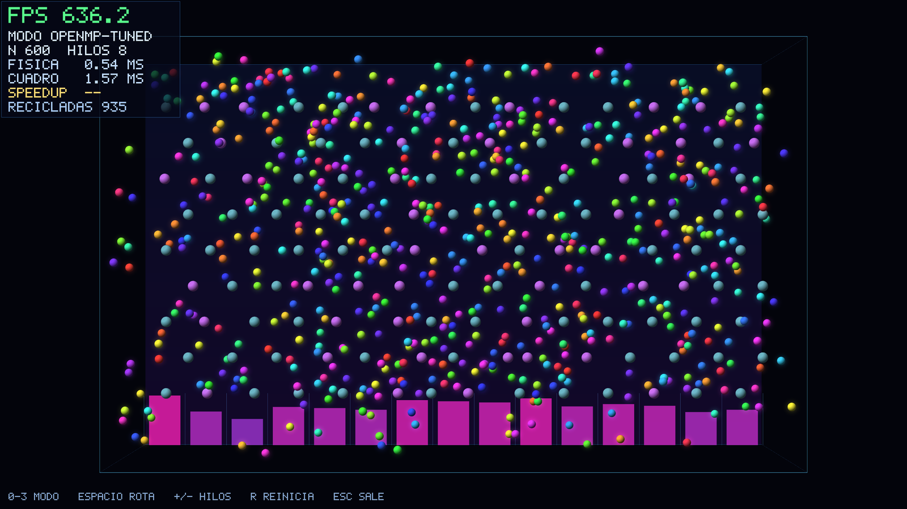

# Plinko 3D Paralelo

Screensaver escrito en C++17 que simula un tablero de Plinko en 3D: **N** pelotas
caen, chocan entre sí, rebotan contra clavijas oscilantes, atraviesan zonas que
alteran su física y terminan contadas en casillas al pie del tablero. Se dibuja
con SDL2 y OpenGL y muestra los FPS en pantalla.

El proyecto compara **cuatro estrategias de ejecución** sobre exactamente el
mismo trabajo: una secuencial, una con un `std::thread` por pelota y dos con
**OpenMP**. Se puede alternar entre ellas con una tecla mientras el programa
corre.

> Proyecto No. 1 — Computación Paralela y Distribuida (CC3086), Universidad del
> Valle de Guatemala, Semestre 2, 2026.
> Ian Cumes (23236) · Javier Valladares (23045) · Nery Molina (23218)



## Resultados

Medido en un Apple M1 Pro (6 núcleos de rendimiento + 2 de eficiencia), 12
repeticiones por configuración. El speedup se calcula contra la versión
secuencial medida con el mismo N.

| N | Secuencial (ms/paso) | `std::thread` | OMP estático 8h | OMP ajustado 8h | Mejor speedup | Eficiencia |
|---|---|---|---|---|---|---|
| 250 | 0.310 | 0.19x | 1.28x | 1.02x | **1.93x** (4 hilos) | 0.48 |
| 500 | 0.868 | 0.20x | 2.02x | 2.06x | **2.75x** (4 hilos) | 0.69 |
| 1000 | 2.712 | 0.20x | 3.06x | 3.47x | **3.87x** (6 hilos) | 0.64 |
| 2000 | 9.270 | no viable | 3.92x | 3.57x | **4.38x** (6 hilos) | 0.73 |
| 4000 | 36.549 | no viable | 3.59x | 4.14x | **4.93x** (6 hilos) | 0.82 |
| 8000 | 137.555 | no viable | 3.13x | 5.90x | **5.90x** (8 hilos) | 0.74 |

Tres cosas que vale la pena señalar:

- **Un hilo por pelota es contraproducente.** Esa versión resulta entre 4 y 5
  veces *más lenta* que la secuencial, y por encima de 1 024 pelotas el sistema
  operativo ya no permite crearla. El costo de despertar y dormir N hilos crece
  con N mientras el trabajo por hilo se mantiene constante.
- **La eficiencia cae a partir de 6 hilos.** El M1 Pro no tiene ocho núcleos
  iguales; con reparto estático los dos núcleos lentos retrasan la barrera.
  `schedule(guided)` recupera buena parte de esa pérdida con carga alta.
- **Paralelizar solo rinde si el problema es grande.** Con N = 250 la sobrecarga
  de la región paralela se come la ganancia; a partir de N ≈ 500 la eficiencia
  crece de forma sostenida.

El análisis completo está en **[docs/Informe_Proyecto1.pdf](docs/Informe_Proyecto1.pdf)**.

## Requisitos

| Dependencia | Notas |
|---|---|
| CMake 3.16 o posterior | |
| Compilador con C++17 | Probado con AppleClang 17 y GCC 13 |
| SDL2 | `brew install sdl2` · `sudo apt install libsdl2-dev` |
| OpenGL | Incluido en el sistema |
| OpenMP | En macOS: `brew install libomp` |

En macOS, AppleClang no trae el runtime de OpenMP. `CMakeLists.txt` lo detecta
solo: si `find_package(OpenMP)` falla, busca la instalación de Homebrew. Si aun
así no lo encuentra, el programa **compila igual** y avisa que los modos de
OpenMP correrán en un solo hilo.

## Compilación

```bash
cmake -S . -B build -DCMAKE_BUILD_TYPE=Release && cmake --build build --parallel
```

## Ejecución

```bash
./build/plinko3d -n 800
```

Sin argumentos, el programa pide N por consola (Enter conserva el valor por
omisión). Con `--no-prompt` usa los valores por omisión sin preguntar.

### Opciones de línea de comandos

No hay ninguna variable fija en el código que afecte la carga de trabajo o el
lienzo: todo se lee de aquí.

**Escena**

| Opción | Descripción | Rango |
|---|---|---|
| `-n`, `--balls <entero>` | Cantidad N de pelotas | 1 – 200 000 |
| `--pegs <filas>x<cols>` | Rejilla de clavijas, p. ej. `9x14` | 0 – 64 cada uno |
| `--modifiers <entero>` | Zonas modificadoras de física | 0 – 256 |
| `--bins <entero>` | Casillas contadoras en la base | 1 – 64 |
| `--radius <decimal>` | Radio de cada pelota | 0.01 – 1.5 |
| `--gravity <decimal>` | Gravedad en unidades/s² | debe ser negativa |
| `--restitution <decimal>` | Coeficiente de restitución | 0 – 1 |
| `--substeps <entero>` | Sub-pasos de integración por cuadro | 1 – 16 |
| `--no-interaction` | Desactiva las colisiones pelota-pelota O(N²) | |
| `--seed <entero>` | Semilla del generador pseudoaleatorio | ≥ 0 |

**Ventana**

| Opción | Descripción | Rango |
|---|---|---|
| `-w`, `--width <entero>` | Ancho del lienzo en píxeles | ≥ 640 |
| `-h`, `--height <entero>` | Alto del lienzo en píxeles | ≥ 480 |
| `--no-vsync` | Desactiva la sincronía vertical | |

**Ejecución**

| Opción | Descripción |
|---|---|
| `-m`, `--mode <modo>` | `seq`, `threads`, `omp-static` u `omp-tuned` |
| `-t`, `--threads <entero>` | Hilos de OpenMP (0 = todos los núcleos) |
| `--no-prompt` | No solicitar datos por consola si faltan |

**Medición**

| Opción | Descripción |
|---|---|
| `--benchmark` | Ejecuta el banco de pruebas sin abrir ventana |
| `--bench-balls <lista>` | Valores de N separados por coma |
| `--bench-threads <lista>` | Cantidades de hilos separadas por coma |
| `--bench-reps <entero>` | Repeticiones por medición (mínimo 10) |
| `--bench-steps <entero>` | Pasos de física por repetición |
| `--bench-out <ruta>` | Archivo CSV de salida |
| `--screenshot <ruta>` | Guarda una captura BMP y termina |
| `--warmup <entero>` | Cuadros simulados antes de la captura |

`--help` imprime todo lo anterior. Cualquier argumento inválido se rechaza con
un mensaje que explica el problema, seguido de la ayuda, y el programa termina
con código distinto de cero.

### Controles

| Tecla | Acción |
|---|---|
| `0` `1` `2` `3` | Secuencial / `std::thread` / OpenMP estático / OpenMP ajustado |
| `ESPACIO` | Rota entre los cuatro modos |
| `+` / `-` | Aumenta o reduce los hilos de OpenMP |
| `R` | Reinicia la escena con una semilla nueva |
| `ESC` o `Q` | Cierra la aplicación |

El HUD muestra en vivo los FPS (verde sobre 58, ámbar entre 30 y 58, rojo por
debajo), el modo activo, N, los hilos, el tiempo de física y el tiempo total por
cuadro, el speedup estimado contra el modo secuencial y el total de pelotas
recicladas.

## Los cuatro modos

Los cuatro comparten el mismo núcleo de física, la función `advanceBall()`, y se
diferencian solo en cómo recorren el arreglo de pelotas y cómo acumulan los
contadores compartidos. Así la comparación mide la estrategia de paralelización,
no dos implementaciones distintas de la física.

| Modo | Estrategia | Sincronía |
|---|---|---|
| `seq` | Ciclo simple sobre las N pelotas | ninguna |
| `threads` | Un `std::thread` persistente por pelota | Barrera de dos fases con mutex y dos `condition_variable` |
| `omp-static` | `#pragma omp parallel for schedule(static)` | `#pragma omp atomic` + barrera implícita del `omp for` |
| `omp-tuned` | Región paralela única, `schedule(guided)` | Contadores privados fusionados con `#pragma omp critical`; `#pragma omp barrier` + `single` para la métrica de desbalance |

### Por qué no hay condiciones de carrera

La simulación mantiene **dos** arreglos de pelotas: `current_` es de solo lectura
durante todo el paso y `next_` tiene un único escritor por índice. Al terminar el
paso se intercambian.

De ahí se siguen tres cosas: ningún hilo escribe una dirección que otro pueda
leer, así que no hace falta ningún candado sobre el estado de las pelotas; el
resultado no depende del orden de ejecución, así que la simulación es
**determinista** y produce los mismos bits con 1 hilo que con 16; y ese
determinismo se puede verificar automáticamente.

Además, cada pelota lleva su propia semilla pseudoaleatoria dentro de su
estructura, en lugar de compartir un generador global que habría que proteger con
un mutex y que haría el resultado dependiente del calendario de los hilos.

## Banco de pruebas

Ejecuta la misma física que el screensaver pero sin ventana ni dibujado, de modo
que el tiempo medido corresponde solo al trabajo que se paraleliza.

```bash
./build/plinko3d --benchmark --bench-balls 250,500,1000,2000,4000,8000 --bench-threads 1,2,4,6,8 --bench-reps 12
```

Escribe `docs/resultados/benchmark.csv` con las cifras agregadas y
`docs/resultados/benchmark_muestras.csv` con cada repetición individual. Usa un
paso de tiempo fijo de 1/60 s y ejecuta tres pasos de calentamiento antes de
cronometrar, para que la creación del equipo de hilos no contamine la primera
toma.

Para regenerar las gráficas y el informe a partir de esos CSV:

```bash
python3 scripts/generar_graficas.py && python3 scripts/generar_informe.py
```

## Pruebas

```bash
ctest --test-dir build --output-on-failure
```

| Suite | Qué verifica |
|---|---|
| `equivalencia_modos` | Los cuatro modos producen un estado final **idéntico bit a bit** tras 180 pasos con 220 pelotas |
| `determinismo_hilos` | El resultado no cambia con 1, 2, 3, 5, 8 o 16 hilos |
| `validacion_argumentos` | 21 casos de línea de comandos, válidos e inválidos |
| `conservacion_conteos` | La suma de las casillas coincide con el total de pelotas recicladas |

La comparación de estados es exacta, sin tolerancia, a propósito: como el diseño
garantiza que las operaciones de punto flotante se ejecutan en el mismo orden en
todos los modos, cualquier diferencia indicaría una condición de carrera real.

**Estado en la versión entregada: 4 de 4 pruebas aprobadas.**

## Estructura del proyecto

```text
include/
  Vec3.h                 Vector de tres componentes y operaciones
  Random.h               Generador SplitMix32 sin estado compartido
  Entities.h             Ball, Peg, Modifier y la oscilación de las clavijas
  SimulationConfig.h     Parámetros, modos y análisis de la línea de comandos
  Simulation.h           Estado del tablero y las cuatro estrategias de avance
  BallThreadSystem.h     Un std::thread persistente por pelota
  Renderer.h             Interfaz del renderizador y datos del HUD
  Benchmark.h            Banco de pruebas sin ventana
  Font5x7.h              Tipo de letra de mapa de bits (generado)
src/
  Simulation.cpp         advanceBall() y las cuatro versiones del paso
  BallThreadSystem.cpp   Barrera de dos fases con mutex y variables de condición
  SimulationConfig.cpp   Validación y programación defensiva
  Benchmark.cpp          Medición, estadísticas y escritura de los CSV
  Renderer.cpp           Tablero, billboards texturizados y HUD
  main.cpp               Ventana, eventos, ciclo principal y liberación
tests/
  SimulationTests.cpp    Las cuatro suites registradas en CTest
scripts/
  generate_font.py       Genera include/Font5x7.h
  generar_graficas.py    Gráficas del informe a partir de los CSV
  generar_informe.py     Informe PDF
  informe_datos.py       Catálogo de funciones y bibliografía
docs/
  Informe_Proyecto1.pdf  Informe completo con los tres anexos
  capturas/              Capturas del programa
  graficas/              Figuras y diagrama de flujo
  resultados/            CSV y bitácora del banco de pruebas
```

## Notas de implementación

- **Renderizado.** Las pelotas y las clavijas se dibujan como billboards
  texturizados (un cuadrilátero con una textura de esfera preiluminada) en lugar
  de mallas de esfera. Con N grande esa decisión es la diferencia entre 6 y 60
  FPS, y deja el costo del cuadro dominado por la física, que es lo que interesa
  medir. Las texturas se generan por código, sin archivos externos.
- **Texto en pantalla.** El HUD usa un tipo de letra de mapa de bits 5×7 incluido
  en el binario, para no depender de SDL_ttf ni de un archivo de fuente.
- **OpenGL en un solo hilo.** El contexto no es seguro para múltiples hilos, así
  que el dibujado ocurre siempre en el hilo principal y solo después de que la
  barrera liberó a todos los hilos de la física.
